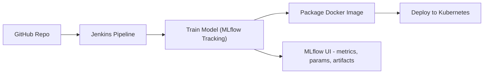

# ml-cicd-jenkins-mlflow

Pipeline CI/CD complet pour ML : **Jenkins** + **MLflow** + **Docker** + **Kubernetes**.

## Objectif
Démontrer un flux automatisé : 
1. Commit → Jenkins déclenche le pipeline
2. Entraînement du modèle avec tracking MLflow
3. Package de l'API (Flask) dans Docker
4. Push image et déploiement sur Kubernetes



## Structure du projet
```
ml-cicd-jenkins-mlflow/
├── src/
│   ├── train.py           # Entraînement du modèle + tracking MLflow
│   ├── app.py             # API Flask pour servir le modèle
│   └── requirements.txt
├── Dockerfile             # Construction de l'image Docker
├── Jenkinsfile            # Pipeline CI/CD Jenkins
├── k8s/                   # Manifests Kubernetes pour app et MLflow
├── mlflow/                # Scripts pour démarrer MLflow local
├── scripts/               # Scripts d'aide (local_run, minikube_deploy)
├── README.md
└── docker-compose.yml     # Optionnel pour demo locale (Jenkins + MLflow)
```

## Pré-requis
- Git
- Docker
- kubectl
- Minikube (pour demo locale) ou cluster Kubernetes
- Jenkins master + agent capable d'exécuter Docker et kubectl

## Lancement local rapide
1. Démarrer MLflow (local) : `bash mlflow/mlflow_server.sh`
2. Lancer la démo locale : `bash scripts/local_run.sh`
3. Pour déployer sur minikube : `bash scripts/minikube_deploy.sh`

## Démo Jenkins
- Créer un pipeline Jenkins en pointant vers ce dépôt
- Ajouter credentials : `docker-hub-creds`, `MLFLOW_URI`
- Push sur GitHub déclenche automatiquement : 
  1. Entraînement du modèle
  2. Build Docker
  3. Push Docker Hub
  4. Déploiement sur Kubernetes

## Validation
- MLflow UI (http://localhost:5000) : metrics, artefacts, modèles
- API déployée : `http://<minikube-ip>:NodePort/predict`

## Bonnes pratiques
- Utiliser MLflow backend robuste (Postgres + S3/GCS) en production
- Stocker credentials Jenkins en secret
- Ajouter tests unitaires et smoke tests dans pipeline
- Optionnel : utiliser Helm chart pour déploiement Kubernetes
